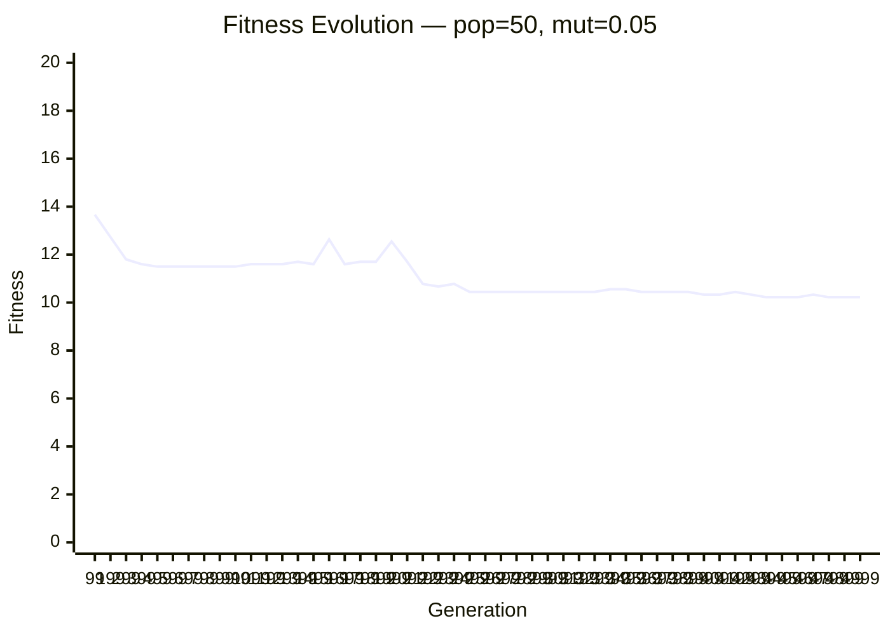
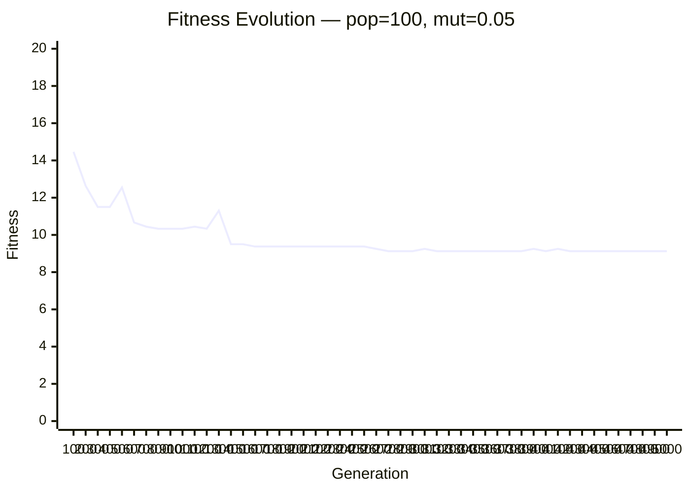
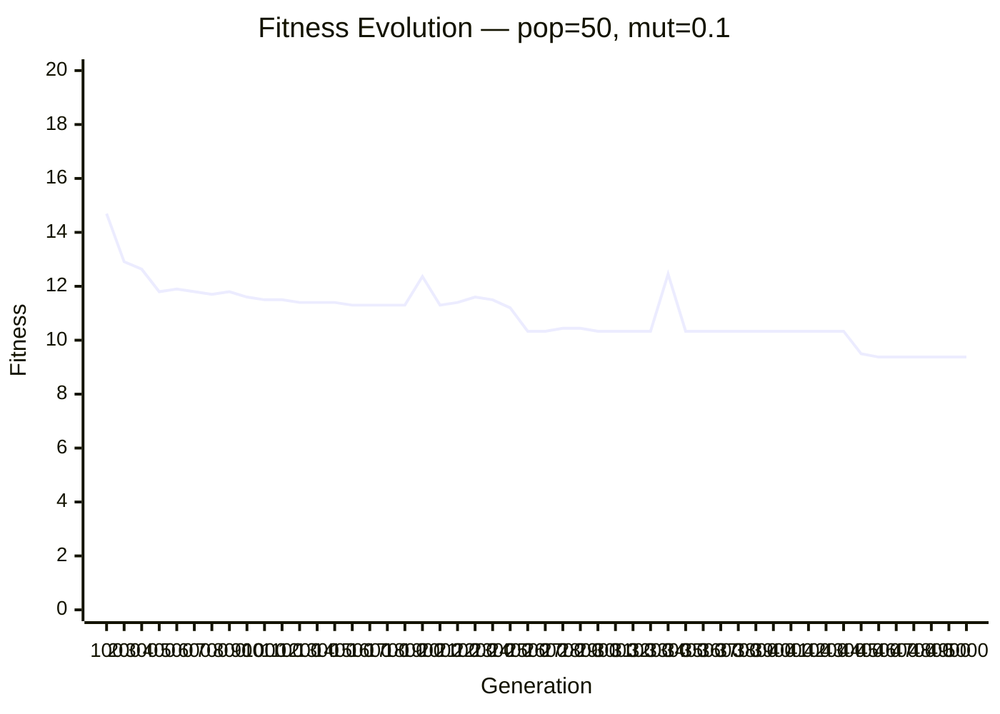

```mermaid
xychart-beta
	title "Fitness Evolution — pop=50, mut=0.05"
	x-axis "Generation" [99, 199, 299, 399, 499, 599, 699, 799, 899, 999, 1099, 1199, 1299, 1399, 1499, 1599, 1699, 1799, 1899, 1999, 2099, 2199, 2299, 2399, 2499, 2599, 2699, 2799, 2899, 2999, 3099, 3199, 3299, 3399, 3499, 3599, 3699, 3799, 3899, 3999, 4099, 4199, 4299, 4399, 4499, 4599, 4699, 4799, 4899, 4999]
	y-axis "Fitness" 0 --> 20
	line [13.666666666666666, 12.727272727272727, 11.8, 11.6, 11.5, 11.5, 11.5, 11.5, 11.5, 11.5, 11.6, 11.6, 11.6, 11.7, 11.6, 12.636363636363637, 11.6, 11.7, 11.7, 12.545454545454545, 11.7, 10.777777777777779, 10.666666666666666, 10.777777777777779, 10.444444444444445, 10.444444444444445, 10.444444444444445, 10.444444444444445, 10.444444444444445, 10.444444444444445, 10.444444444444445, 10.444444444444445, 10.444444444444445, 10.555555555555555, 10.555555555555555, 10.444444444444445, 10.444444444444445, 10.444444444444445, 10.444444444444445, 10.333333333333334, 10.333333333333334, 10.444444444444445, 10.333333333333334, 10.222222222222221, 10.222222222222221, 10.222222222222221, 10.333333333333334, 10.222222222222221, 10.222222222222221, 10.222222222222221]
```

```mermaid
xychart-beta
	title "Fitness Evolution — pop=100, mut=0.05"
	x-axis "Generation" [100, 200, 300, 400, 500, 600, 700, 800, 900, 1000, 1100, 1200, 1300, 1400, 1500, 1600, 1700, 1800, 1900, 2000, 2100, 2200, 2300, 2400, 2500, 2600, 2700, 2800, 2900, 3000, 3100, 3200, 3300, 3400, 3500, 3600, 3700, 3800, 3900, 4000, 4100, 4200, 4300, 4400, 4500, 4600, 4700, 4800, 4900, 5000]
	y-axis "Fitness" 0 --> 20
	line [14.461538461538462, 12.636363636363637, 11.5, 11.5, 12.545454545454545, 10.666666666666666, 10.444444444444445, 10.333333333333334, 10.333333333333334, 10.333333333333334, 10.444444444444445, 10.333333333333334, 11.3, 9.5, 9.5, 9.375, 9.375, 9.375, 9.375, 9.375, 9.375, 9.375, 9.375, 9.375, 9.375, 9.25, 9.125, 9.125, 9.125, 9.25, 9.125, 9.125, 9.125, 9.125, 9.125, 9.125, 9.125, 9.125, 9.25, 9.125, 9.25, 9.125, 9.125, 9.125, 9.125, 9.125, 9.125, 9.125, 9.125, 9.125]
```

```mermaid
xychart-beta
	title "Fitness Evolution — pop=50, mut=0.1"
	x-axis "Generation" [100, 200, 300, 400, 500, 600, 700, 800, 900, 1000, 1100, 1200, 1300, 1400, 1500, 1600, 1700, 1800, 1900, 2000, 2100, 2200, 2300, 2400, 2500, 2600, 2700, 2800, 2900, 3000, 3100, 3200, 3300, 3400, 3500, 3600, 3700, 3800, 3900, 4000, 4100, 4200, 4300, 4400, 4500, 4600, 4700, 4800, 4900, 5000]
	y-axis "Fitness" 0 --> 20
	line [14.692307692307692, 12.90909090909091, 12.636363636363637, 11.8, 11.9, 11.8, 11.7, 11.8, 11.6, 11.5, 11.5, 11.4, 11.4, 11.4, 11.3, 11.3, 11.3, 11.3, 12.363636363636363, 11.3, 11.4, 11.6, 11.5, 11.2, 10.333333333333334, 10.333333333333334, 10.444444444444445, 10.444444444444445, 10.333333333333334, 10.333333333333334, 10.333333333333334, 10.333333333333334, 12.454545454545455, 10.333333333333334, 10.333333333333334, 10.333333333333334, 10.333333333333334, 10.333333333333334, 10.333333333333334, 10.333333333333334, 10.333333333333334, 10.333333333333334, 10.333333333333334, 9.5, 9.375, 9.375, 9.375, 9.375, 9.375, 9.375]
```

```mermaid
xychart-beta
	title "Fitness Evolution — pop=100, mut=0.1"
	x-axis "Generation" [100, 200, 300, 400, 500, 600, 700, 800, 900, 1000, 1100, 1200, 1300, 1400, 1500, 1600, 1700, 1800, 1900, 2000, 2100, 2200, 2300, 2400, 2500, 2600, 2700, 2800, 2900, 3000, 3100, 3200, 3300, 3400, 3500, 3600, 3700, 3800, 3900, 4000, 4100, 4200, 4300, 4400, 4500, 4600, 4700, 4800, 4900, 5000]
	y-axis "Fitness" 0 --> 20
	line [12.636363636363637, 11.8, 13.583333333333334, 11.7, 11.6, 10.777777777777779, 10.777777777777779, 10.666666666666666, 10.666666666666666, 10.666666666666666, 10.666666666666666, 10.666666666666666, 10.666666666666666, 11.6, 10.777777777777779, 10.666666666666666, 13.5, 10.88888888888889, 11.5, 10.666666666666666, 12.454545454545455, 11.6, 10.666666666666666, 10.666666666666666, 10.666666666666666, 12.454545454545455, 12.545454545454545, 10.666666666666666, 10.777777777777779, 10.666666666666666, 10.666666666666666, 10.666666666666666, 10.666666666666666, 10.777777777777779, 11.5, 9.75, 9.75, 9.75, 9.75, 9.875, 9.75, 9.625, 9.625, 9.625, 9.625, 9.625, 9.625, 9.5, 9.5, 9.5]
```
